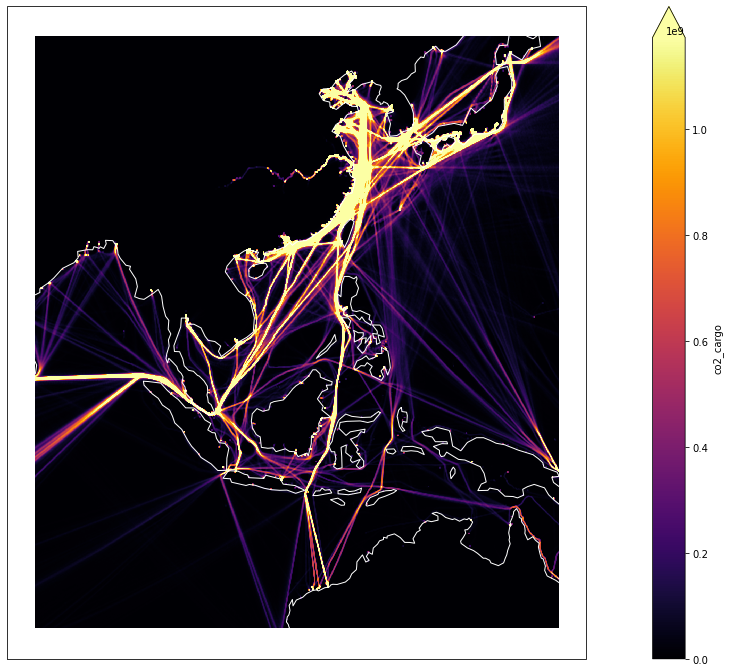
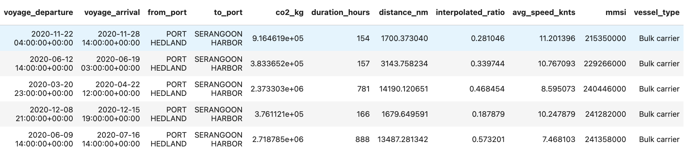
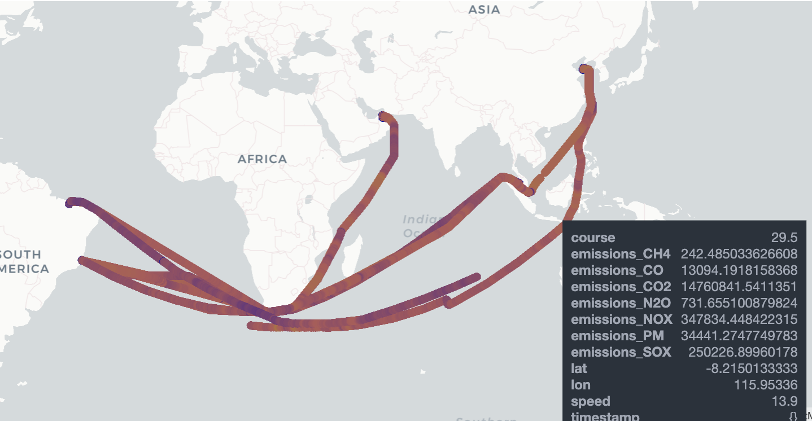

# Climate Hackathon 2022

***CHALLENGE BY HUB OCEAN AND COGNITE (NORWAY)*** <br>
The environmental effects of marine transport include air pollution, water pollution, acoustic, and oil pollution. The share of maritime transport emissions in global anthropogenic emissions has increased from 2.76% in 2012 to 2.89% in 2018 according to IMO’s Fourth Greenhouse Gas Study. At the same time, the demand for seaborne trade is projected to grow by 39% until 2050. 

Concepts like “green corridors” (specific trade routes between major port hubs where zero-emission solutions are supported and demonstrated) and “blue corridors” (critical ocean habitats for migratory marine species) are surfacing as potential solutions to enable early adoption of alternative fuels and conservation of vulnerable ocean areas. Various stakeholders such as financial institutions, administrative authorities and ordinary consumers (you and me) increasingly have a need to understand what "green transportation" is so that one can make the right choices and influence the decision makers. Through compelling data storytelling it should, in theory, be possible to demystify this 

HUB Ocean's unique vessel emissions datasets, form the foundation for this challange, providing vessel emissions and traffic data from gridded density maps down to hourly emissions for almost every larger vessel in the world.

<br>***Gridded vessel emissions*** <br>
Xarray style dataset with vessel emissions and total hours per month and vessel type. Vessel types avalable are tanker, cargo, passenger, fishing and total (all vessels). The data is stored as .zarr files in the folder ```zarr/vessel_emissions_and_traffic/``` in blob storage. This dataset can be used to find the most polluting routes, and estimate the potential for green corridors with alternative fuel infrastructure. his dataset can be used to see how traffic or emissions change over time in a geographical area. See Tutorial 1 for how to use.
 <br>
 
<br>***Voyage emissions tables***<br>
Pandas style dataset consisting of from/to ports and total co2 emission per vessel. The data is available as .parquet files in the folder ```parquet/voyage_tables/``` in blob storage. The voyage tables are divided into folders based on vessel categories like Container, Oil tanker, Cruice etc. See Tutorial 2 for how to get going.
<br>

<br>***Hourly emissions data per vessel***<br> 
The raw emissions data that the other datasets are derived from. It consists of timestamps, coordinates and hourly emissions in grams for CO2 and other gases to air. The data is available in a PostgreSQL database through the function ```get_emissions_from_vessel(int mmsi)```. This database table can be used to look at specific vessels and to do spot checks of the voyage tables. See Tutorial 3 for how to use.
vessel_emissions_per_ship
<br>
 

To access the datasets, connection strings need to be set for these two environmental variables:
```
HACKATHON_DB_CONNECTION
```
```
HACKATHON_CONNECTION_STR
```
This is not needed if running the notebooks in the Ocean Data Connector (The jupyter lab environment in the Ocean Data Platform).

<br>***Other datasets***<br> 
Other datasets than can come in handy for this challenge are listed below:
- OBIS BIodiversity dataset: https://obis.org/data/access/
- Marine regions: https://www.marineregions.org/downloads.php
- World Database on Protected Areas: https://www.iucn.org/theme/protected-areas/our-work/world-database-protected-areas

